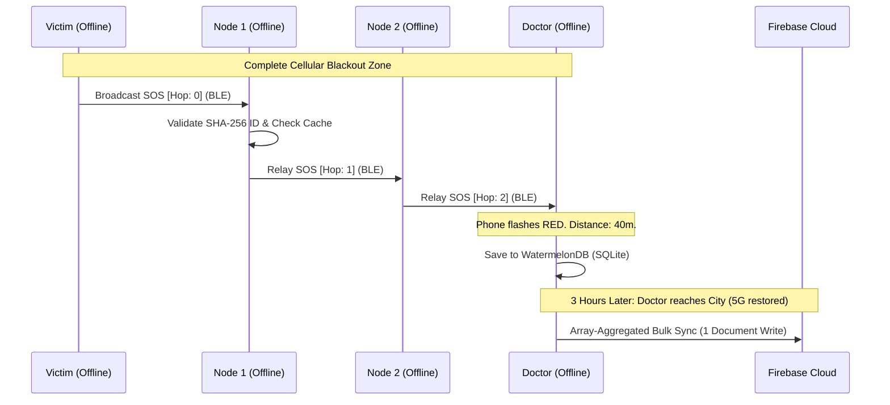

  
  <h1>- ResQNode -</h1>
  
<strong>The Decentralized, Offline-First Survival Mesh Network</strong>

  
  

    
    
    
    
    
  

---

## The Genesis: Inverting Aarogya Setu

The fundamental architecture of **ResQNode** was inspired by the engineering marvel of India's *Aarogya Setu* (built by NIC-Delhi). Aarogya Setu used Bluetooth Low Energy (BLE) to create a nationwide, anonymous contact-tracing grid to detect proximity to a virus. 

We asked ourselves a radical question: **"What if we inverted this architecture? Instead of tracing a virus, what if we traced human life during a catastrophic blackout?"**

During severe natural disasters (earthquakes, floods) or remote accidents (train derailments in dense forests), the first piece of infrastructure to collapse is the mobile tower network. Traditional SOS apps become instantly useless. ResQNode was born to build a **zero-infrastructure, indestructible communication grid** that relies solely on the smartphones already in people's pockets.

---

## The Core Problem: Why Traditional Apps Fail

When disaster strikes, the immediate aftermath is defined by the **Information Blackhole**. 

| Feature | Traditional SOS Apps (e.g., Apple SOS, WhatsApp) | 🚨 ResQNode |
| :--- | :--- | :--- |
| **Network Requirement** | Requires active 4G/5G, WiFi, or Satellite. | **Zero Network Required.** Uses peer-to-peer Bluetooth. |
| **Infrastructure** | Relies on external cellular towers. | **Decentralized.** Every phone becomes a mini-tower. |
| **Battery Consumption** | High (constantly searching for lost cell signals). | **Ultra-Low.** Aggressive background BLE duty-cycling. |
| **Language Barrier** | Victim and rescuer must speak the same language. | **Offline AI Translator.** On-device local STT & TTS. |
| **Local Proximity** | Sends GPS coordinates to a distant server. | **Radar Pulse.** Guides rescuers via raw BLE RSSI distance. |

---

## Technical Architecture

ResQNode relies on an advanced, hardware-level mesh routing protocol combined with a highly optimized local SQLite database to prevent UI freezing during massive data ingestion.

### The 16-Byte BLE Payload
To ensure signals propagate faster than the speed of human movement while adhering to strict Bluetooth advertisement limits, our custom payload is exactly 16 bytes:

| Byte Index | Field Name | Description |
| :--- | :--- | :--- |
| `0 - 1` | **Manufacturer ID** | `0xFFFF` - Identifies the packet as a ResQNode signal. |
| `2` | **Intent Flag** | `0x01` (Medical), `0x02` (Trauma), `0x03` (Supply Drop). |
| `3 - 10` | **Hashed DID** | 8 bytes of a SHA-256 hashed Device ID (ensures privacy). |
| `11 - 14` | **Timestamp** | 4-byte Int32 UNIX Epoch timestamp (anti-replay attacks). |
| `15` | **Hop Count** | Used to prevent infinite network loops (Max 4 hops). |

---

## Engineering Highlights

### 1. BLE Mesh Daisy-Chaining & Anti-Echo Protocol
To prevent "Broadcast Storms" (where 1,000 phones infinitely bounce the same signal, crashing the network), ResQNode uses an aggressive **Anti-Echo Cache**. Any signal verified via its cryptographic ID and timestamp is blacklisted from being relayed again for 60 seconds. Signals are strictly bounded by a `Max_Hop_Count` of 4.

### 2. GovTech-Grade Offline Data Engine
We utilize **WatermelonDB (SQLite)** layered over native JSI (JavaScript Interface). If 5,000 background mesh packets hit the phone concurrently in a crowded disaster zone, the UI thread never freezes. Data is batched in memory and flushed to disk every 3 seconds via an Android Foreground Service.

### 3. Cloud Sync: The Array Aggregation Hack
Once a rescue worker leaves the offline disaster zone and regains internet access, the app executes a massive background sync. Instead of making 10,000 separate database writes to Firebase (which would instantly burn the free tier quota), it compresses the entire mesh history into a single JSON Array and executes exactly **One Write Operation**.

### 4. Hardware Duty-Cycle Management
Continuous Bluetooth scanning drains batteries. ResQNode anchors to an **Android Foreground Service** (immune to Android Doze mode) and utilizes aggressive duty-cycling, ensuring a victim's phone can survive for days while broadcasting.

---

## Real-Life Impact Scenarios

### Scenario A: The Remote Train Derailment
A major train derails in a dense, remote jungle at 2:00 AM. 
* **The Victim:** A passenger in Coach S4 suffers severe trauma. Their relative opens ResQNode and triggers a "Medical SOS". The phone broadcasts an invisible BLE pulse.
* **The Mesh Hop:** Another passenger in Coach S5, unaware of the situation, has ResQNode running in the background. Their phone catches the faint SOS signal from S4 and automatically amplifies and relays it forward.
* **The Responder:** The signal bounces down to Coach S7, where an off-duty doctor is sitting. Their phone flashes Red with a critical alert. Using ResQNode's **Proximity Radar**, the doctor is guided exactly 40 meters backward to Coach S4 to provide immediate triage.

### Scenario B: The Language Barrier
Upon arriving at Coach S4, the Doctor realizes the victim speaks Bengali, while the Doctor speaks Kannada. There is no internet for Google Translate. 
* **The Solution:** They open ResQNode's **Offline Voice Translator**. Utilizing on-device native Speech-to-Text and Text-to-Speech libraries, the app displays a split-screen inverted UI. The victim speaks in Bengali, the AI processes it locally, and translates it instantly to Kannada, saving precious minutes during the "Golden Hour".

---

## Privacy & Security
ResQNode uses **SHA-256 Hashing** for all Device IDs (DIDs) broadcasted over the air. The mesh network relies strictly on anonymous, mathematically hashed signatures. No personal phone numbers, real names, or GPS locations are ever broadcasted in plain text, preventing malicious actors from exploiting the network during a disaster.

---

> *"Infrastructure will fail. Humanity won't. Built for the darkest hours."*
